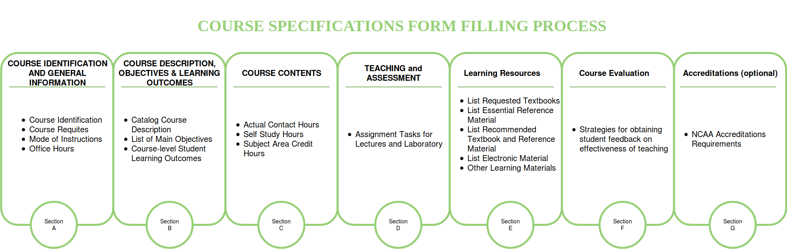
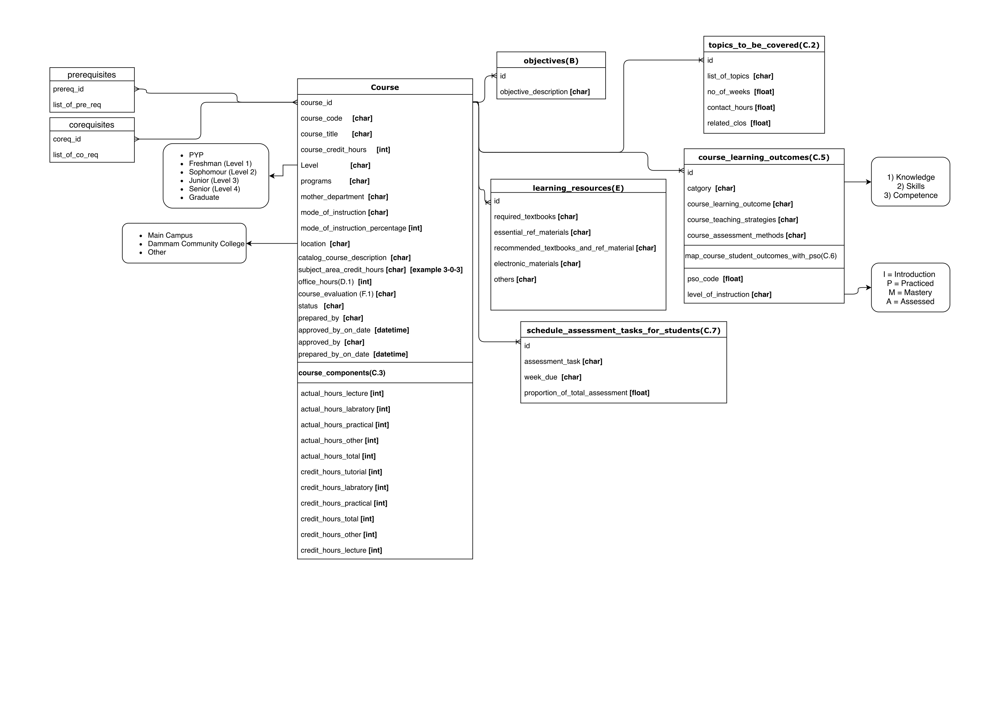
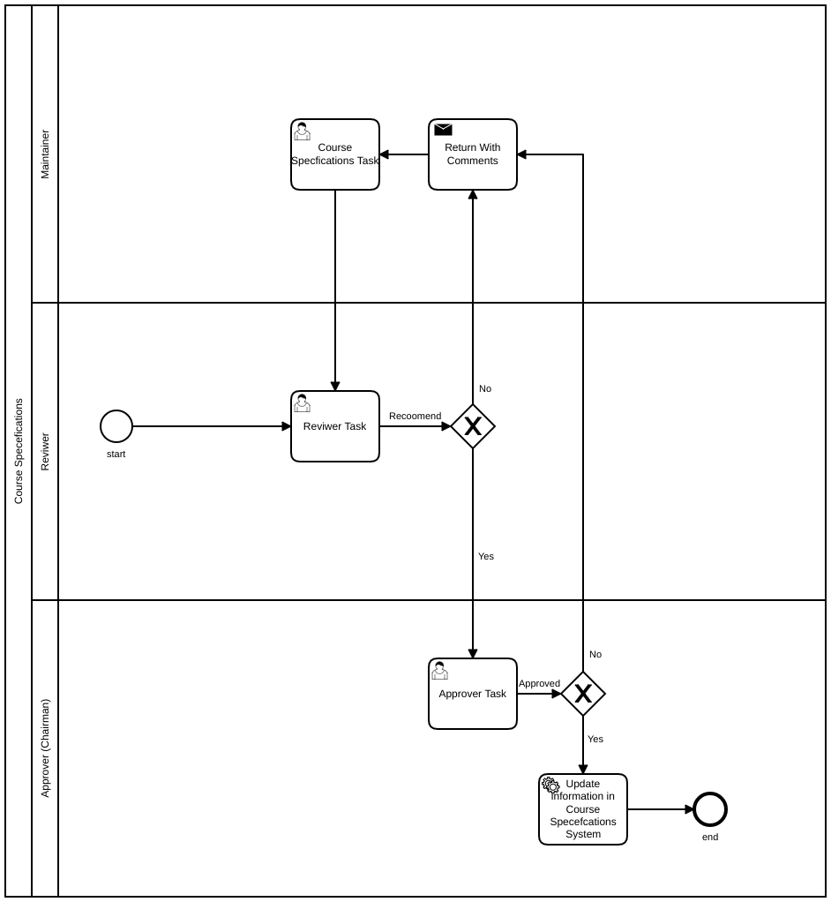

= Software Requirements Specification for Course Specifications
Information & Communications Technology Center (ICTC), KFUPM
Version 1.0, 19 May 2019: First version

include::includes/proprietary-information.adoc[]

[discrete]
== Document Classification
Internal

[discrete]
== Version History

[cols="1,3,1,4",options="header",small]
|==================================================
| Version | Author(s) | Date      | Change
| 1.0     | Ali Al-Jowaher  <ali.aljowaher@kfupm.edu.sa> |  2019-03-20 | First version
|==================================================

[discrete]
== Approvals

[cols="1h,3,1h,1",frame=none,grid=none]
|==================================================
| Name        | Khalid Abdullah Aljasser | Role    | Sponsor
| Designation | Assistant Director  | Version | 1.0
| Department  | ICTC                 | Date    | 2019-05-19
|==================================================

[cols="1h,3,1h,1",frame=none,grid=none]
|==================================================
| Name        |Saad Saeed Al-Abeedi | Role    | Client
| Designation |Director            | Version | 1.0
| Department  |Academic Assessment Center| Date |
|==================================================

[cols="1,",frame=none,grid=none]
|===
|Signature|

|===

<<<

== Introduction

=== Purpose and Intended Audience

The document is intended for the purpose of identification and alignment of Course Specification Software Requirements.

=== Product Scope

The automation and enhancement of the the course specifications form filling steps and process.

=== Definitions, Acronyms, and Abbreviations

[horizontal]
First term :: First term definition.
CrH :: Credit Hours
CnH :: Contact Hours
CLOs :: Course Learning Outcomes
PLOs :: Program Learning Outcomes

=== References

CRF2 Form

=== Overview of Document

the document contains the digram , work flows and processes related to
course specification filling.

== Overall Description

=== Product Perspective

The Course Specification system is considered the foundation and sub system of the Course File Project .

=== Product Functions

== External Interface Requirements

=== User Interfaces

== Functional Requirements

=== Form Filling Process

ID: CSR1

==== Description

The system is designed to aid faculty members in filling the Course
Specification form in a comprehensive and simplistic manner .

=== Automatic calculation of Contact Hours Based on Credit Hours

ID: CSR2

==== Description

the calculation of Lecture and Laboratory contact hours will be based on
three number format (ex. 3-4-4), Which then will be reflected in the course
content section dynamically.Also ,the list of topics should not exceed the number
of contact hours calculated.

=== Course Learning Outcomes and Program Learning Outcomes

ID: CSR3

==== Description

The faculty member should be able to fill in the course learning outcomes
(aka SO 1-to-7).

=== Accreditation Requirements (ex. NCAAA)

ID: CSR4

==== Description

The faculty member should be able to fill in the accreditation details when
necessary , Hence the Accreditation section won't be visible unless it's required.

=== Creating a new Course Specification

ID: CSR5

==== Description

The Chairman has the ability to create a initial new course specifications.

=== Review and Approval Work-flow.

ID: CSR6

==== Description

NOTE: The current Work-flow  implementation is  up-to the Chairman approval

The current course specification work-flow consists of :

* Course Maintainer (appointed by Chairman)
* Course Reviewer (appointed by Chairman)
* Course Approver (Chairman)

The flow start by the Chairman assigning the maintainer and reviewer.

. The Maintainer will fill the course specifications and submit it for approval.

. The Reviewer will review the course specifications and have two options:

.. Submit for Approval

.. Return with comments to maintainer

. The Approver (chairman) will be able to review the course specifications and approve them.

=== Course Specifications Status Change

ID: CSR7

==== Description

The course specifications process will have the following Statues :

* Draft
* Submitted for Review
* In Review
* Submitted for Approval
* Approved
* Returned with comments (by Chairman or assigned Reviewer)

[appendix]
== Data Model

== Approval Work-flow Model

