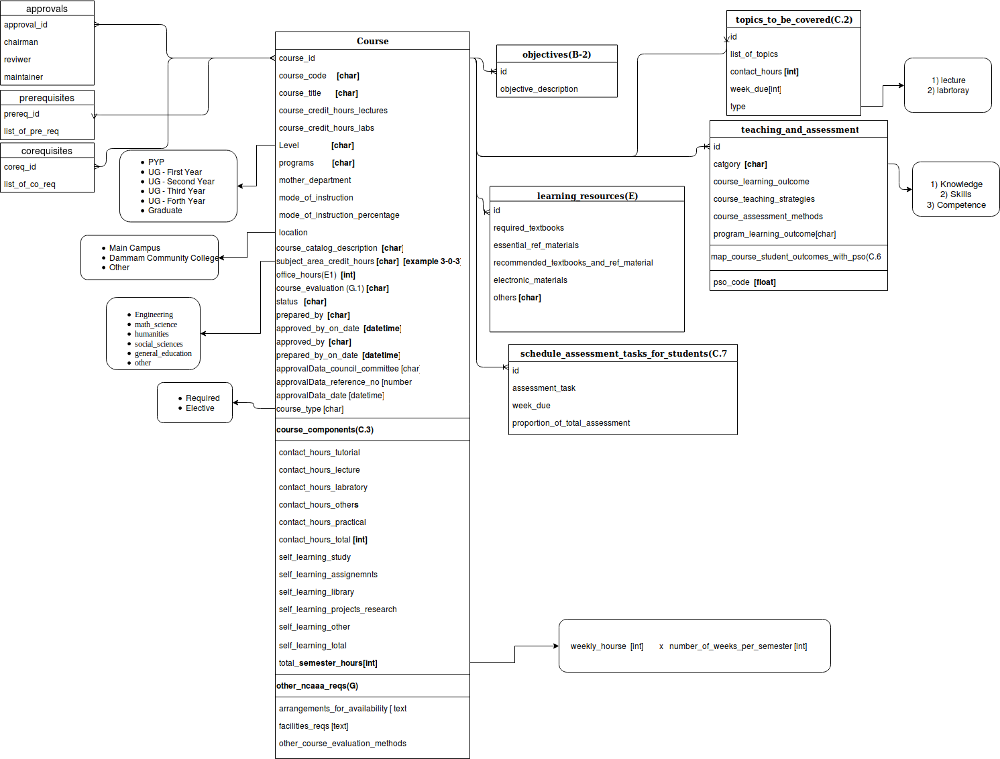

= Software Requirements Specification for Course Specification
Information & Communications Technology Center (ICTC), KFUPM
Version 1.0, 20 March 2019: First version

include::includes/proprietary-information.adoc[]

[discrete]
== Document Classification
Internal

[discrete]
== Version History

[cols="1,3,1,4",options="header",small]
|==================================================
| Version | Author(s) | Date      | Change
| 1.0     | Ali Al-Jowaher  <ali.aljowaher@kfupm.edu.sa> |  2019-03-20 | First version
|==================================================

[discrete]
== Approvals

[cols="1h,3,1h,1",frame=none,grid=none]
|==================================================
| Name        |                     | Role    | Sponsor
| Designation |                     | Version | 1.0
| Department  | ICTC                 | Date    |
|==================================================

[cols="1h,3,1h,1",frame=none,grid=none]
|==================================================
| Name        |                     | Role    | Client
| Designation |                     | Version | 1.0
| Department  |                     | Date    |
|==================================================

<<<

== Introduction

=== Purpose and Intended Audience

The document is intended for the purpose of identification and alignment of Course Specification Software Requirements.

=== Product Scope

The automation and enhancement of the the course specifications form filling steps and process.

=== Definitions, Acronyms, and Abbreviations

[horizontal]
First term :: First term definition.
CrH :: Credit Hours
CnH :: Contact Hours
CLOs :: Course Learning Outcomes
PLOs :: Program Learning Outcomes

=== References

CRF2 Form

=== Overview of Document

the document contains the digram , work flows and processes related to
course specification filling.

== Overall Description

=== Product Perspective

The Course Specification system is considered the foundation and sub system of the Course File Project .

=== Product Functions

image::images/cs-form-filling-process.png[]

== External Interface Requirements

=== User Interfaces

== Functional Requirements

=== Form Filling Process

ID: CSR1

==== Description

The system is designed to aid faculty members in filling the Course
Specification form in a comprehensive and simplistic manner .

=== Automatic calculation of Contact Hours Based on Credit Hours

ID: CSR2

==== Description

the calculation of Lecture and Laboratory contact hours will be based on
three number format (ex. 3-4-4), Which then will be reflected in the course
content section dynamically.Also ,the list of topics should not exceed the number
of contact hours calculated.

=== Course Learning Outcomes and Program Learning Outcomes

ID: CSR3

==== Description

The faculty member should be able to fill in the course learning outcomes
(aka SO 1-to-7).

=== Accreditation Requirements (ex. NCAAA)

ID: CSR4

==== Description

The faculty member should be able to fill in the accreditation details when
necessary .

=== Review and Approval Work-flow

ID: CSR5

==== Description

The current course specification work-flow consists of :

. Course Maintainer (appointed by Chairman)
. Course Reviewer (appointed by Chairman)
. Course Approver (Chairman)

== Other Nonfunctional Requirements

=== Data Requirements

All the data entered by the system users should be automatically validated to make sure that it matches the intended data types and formats.

=== Performance Requirements

<If there are performance requirements for the product under various
circumstances, state them here and explain their rationale, to help
the developers understand the intent and make suitable design
choices. Specify the timing relationships for real time systems. Make
such requirements as specific as possible. You may need to state
performance requirements for individual functional requirements or
features.>

=== Safety Requirements

<Specify those requirements that are concerned with possible loss,
damage, or harm that could result from the use of the product. Define
any safeguards or actions that must be taken, as well as actions that
must be prevented. Refer to any external policies or regulations that
state safety issues that affect the product’s design or use. Define
any safety certifications that must be satisfied.>

=== Security Requirements

<Specify any requirements regarding security or privacy issues
surrounding use of the product or protection of the data used or
created by the product. Define any user identity authentication
requirements. Refer to any external policies or regulations containing
security issues that affect the product. Define any security or
privacy certifications that must be satisfied.>

=== Software Quality Attributes

<Specify any additional quality characteristics for the product that
will be important to either the customers or the developers. Some to
consider are: adaptability, availability, correctness, flexibility,
interoperability, maintainability, portability, reliability,
reusability, robustness, testability, and usability. Write these to be
specific, quantitative, and verifiable when possible. At the least,
clarify the relative preferences for various attributes, such as ease
of use over ease of learning.>

===  Business Rules

<List any operating principles about the product, such as which
individuals or roles can perform which functions under specific
circumstances. These are not functional requirements in themselves,
but they may imply certain functional requirements to enforce the
rules.>

== Other Requirements

<Define any other requirements not covered elsewhere in the SRS. This
might include database requirements, internationalization
requirements, legal requirements, reuse objectives for the project,
and so on. Add any new sections that are pertinent to the project.>

[appendix]
== Analysis Models

[appendix]
== To Be Determined List

<Collect a numbered list of the TBD (to be determined) references that
remain in the SRS so they can be tracked to closure.>

Source: http://www.frontiernet.net/~kwiegers/process_assets/srs_template.doc
